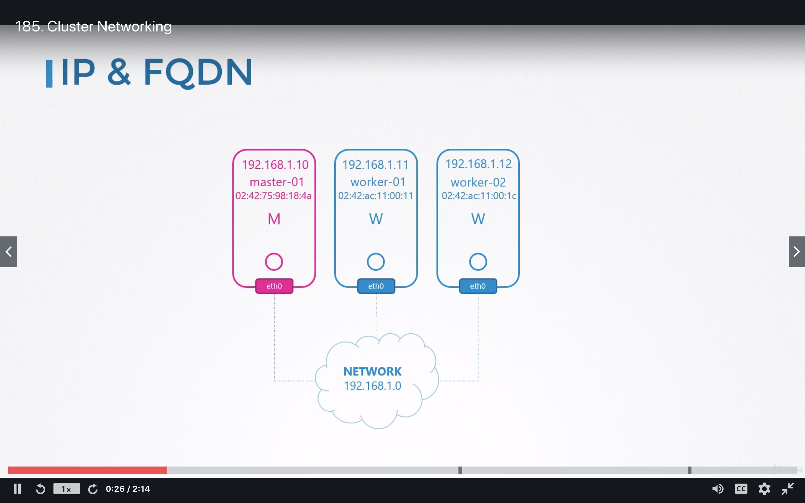
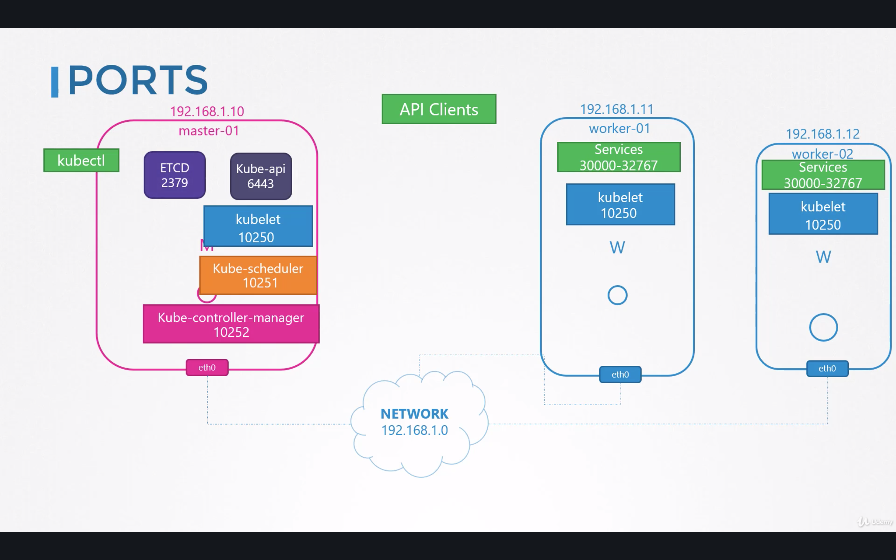
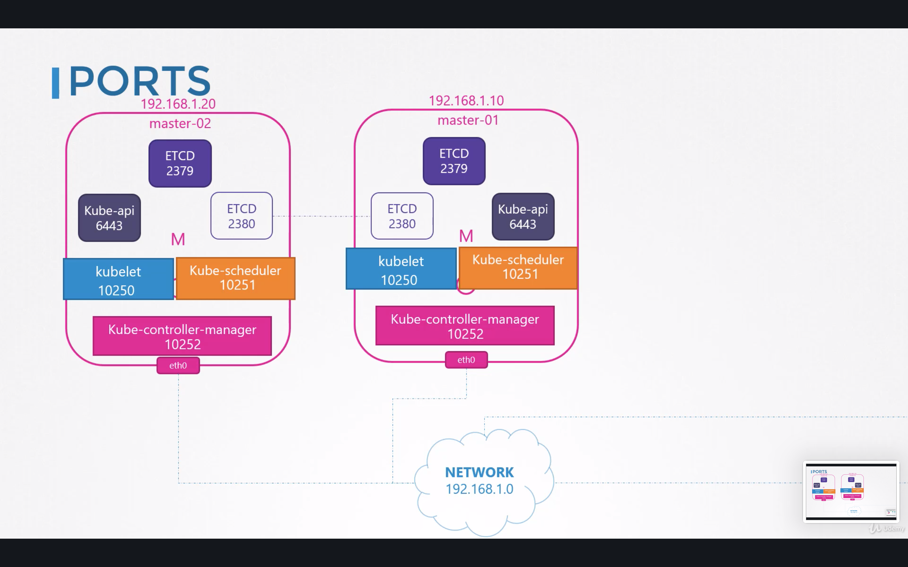
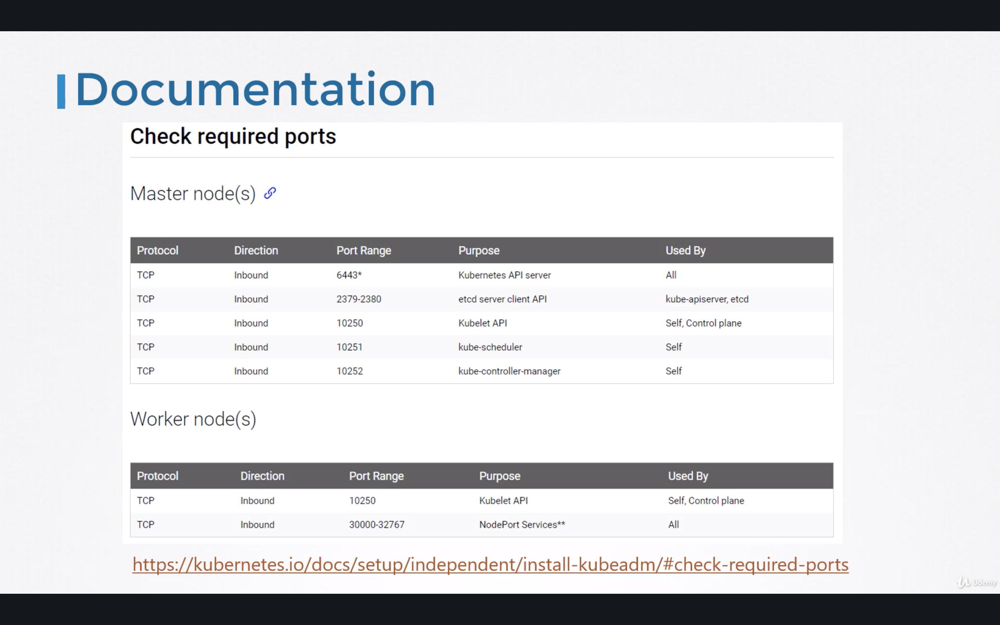
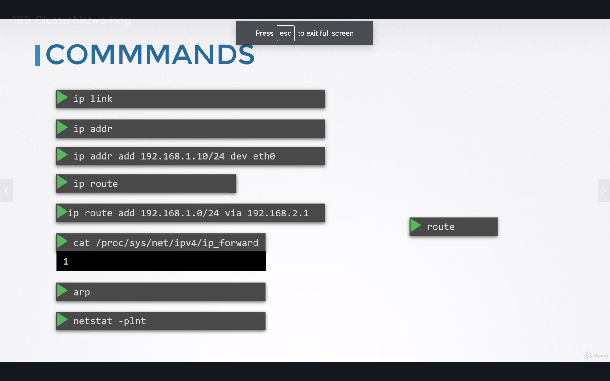

# K8 cluster
- Build from master and worker nodes
- Each node must have network configured

- Nodes must have some port open for communications

- Multiple master nodes

- k8 ports

- networking commands
